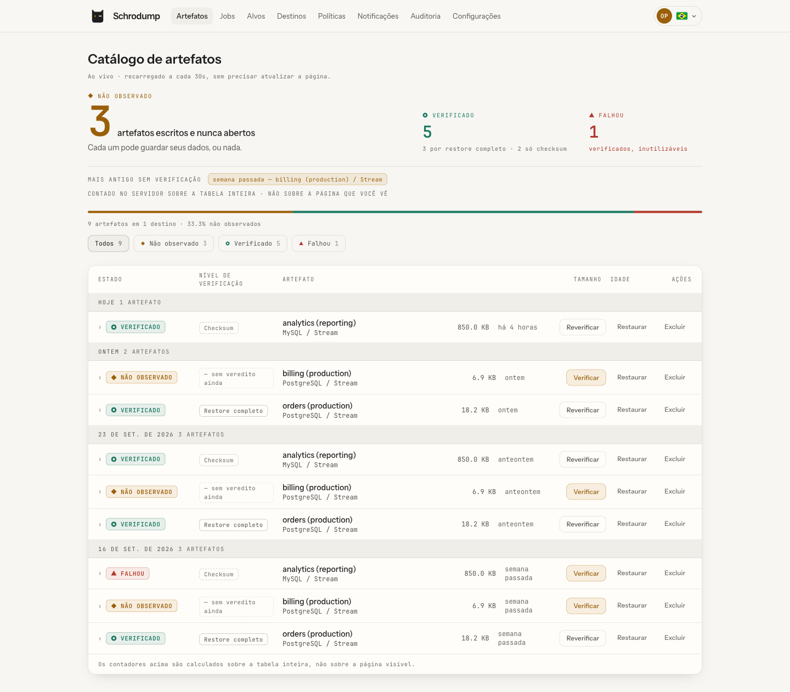

<div align="center">

# Schrodump

**Backups lógicos verificados para PostgreSQL, MySQL/MariaDB e MongoDB.**

Um backup que um restore não provou não é um backup — é um palpite.

[](LICENSE)
[](.nvmrc)
[](https://github.com/schrodump/schrodump/actions/workflows/ci.yml)
[](https://github.com/schrodump/schrodump/actions/workflows/security.yml)

[English](README.md) · **Português** · [Español](README.es.md)

</div>

---

> **Beta: pré-1.0, um mantenedor.** Dezenove release candidates, nenhuma release estável ainda.
>
> **O que está provado.** Todo pull request sobe o `compose.yaml` que a gente publica e passa vinte
> e dois passos por ele: as quatro engines nos dois modos de execução, cada uma verificada por um
> restore de verdade, três delas restauradas por cima de dados vivos, um catálogo reconstruído só a
> partir do bucket, uma rotação de chave com o artefato anterior ainda legível, a retenção apagando
> de fato, uma notificação assinada e um e-mail entregues.
>
> **O que não está.** Nada foi marcado como estável, então ainda não há promessa sobre atualizar de
> uma versão para a seguinte, e o v1 sai com arestas conhecidas — todas escritas em
> [docs/roadmap.md](docs/roadmap.md#known-limitations-shipping-in-v1). Leia essa lista antes de
> depender disto.

## Por que Schrodump

Um job de backup que sai com código `0` provou uma coisa só: um processo rodou sem reclamar. **Não**
provou que o arquivo no seu bucket contém os dados. Uma credencial que escreve mas não lê, um dump
truncado quando a conexão caiu, uma regra de retenção que apagou a última cópia boa — todos produzem
um job verde e um artefato inútil, observável só na hora do restore.

Por isso o Schrodump se recusa a chamar um backup de bom só porque o job teve sucesso. Todo artefato
está em **um de três estados**, e a cor é conteúdo, não decoração:

| Estado | | Significado |
| --- | --- | --- |
| 🟢 **VERIFIED** | verde | Algo abriu e conferiu. Por padrão, isso significa que foi restaurado num banco descartável; um verde só por checksum diz isso ao lado do selo. |
| 🟡 **UNOBSERVED** | âmbar | Foi escrito; ninguém olhou dentro. Pode estar perfeito, ou vazio. **É o default.** |
| 🔴 **FAILED** | vermelho | Foi conferido e não presta. |

Não existe "OK". O painel lidera pelo número de backups **não observados** — as perguntas em aberto
— não pelo número de jobs que tiveram sucesso. Essa inversão é o produto inteiro.

<div align="center">

<picture>
  <source media="(prefers-color-scheme: dark)" srcset="docs/assets/artifact-catalog-pt-BR-dark.png">
  
</picture>

<sub>O catálogo é a tela inicial, e o número que ele lidera é o que ninguém conferiu.</sub>

</div>

## Recursos

- **Restore verificado** — por padrão todo backup é restaurado num banco descartável e conferido; um
  checksum, mais barato, é uma escolha por política, e o selo diz de qual dos dois veio um verde.
- **Agentless** — nada é instalado no host do seu banco. Os dumps rodam em contêineres efêmeros
  construídos a partir da major version do próprio alvo.
- **Cifrado em repouso** — todo artefato é cifrado com [`age`](https://age-encryption.org) para dois
  recipients (operacional + escrow); essas duas chaves são envelopadas por uma KEK que pertence a um
  gerenciador de segredos, injetada no start. O início rápido abaixo escreve a KEK no `.env` do
  host para você subir, e tirá-la de lá é a primeira coisa a fazer.
- **Destinos S3-compatible** — AWS S3, Cloudflare R2, Backblaze B2, MinIO, SeaweedFS, Ceph RGW.
- **Agendamento com retenção GFS** — avô-pai-filho por contagem e por janela de calendário, rodando
  só quando um backup novo da mesma política entrou, e nunca apaga a cópia verificada mais recente
  de uma política.
- **Atrito de restore de propósito** — restrito por papel, limitado por uma matriz de capacidade da
  engine, e sobrescrever um banco exige digitar o nome dele.
- **Interface web** — um painel construído em torno dos três estados, em inglês, português e espanhol.
- **Docker-first** — uma imagem única sem clients de banco, releases multi-arch assinadas com SBOM
  anexado.

## Experimente em cinco minutos

Antes de provisionar qualquer coisa, rode o produto inteiro sobre dados descartáveis no seu laptop.
Um comando sobe o Schrodump, um MinIO no lugar do seu object storage, o bucket dentro dele e um
PostgreSQL com dados de exemplo que valem um backup:

```sh
git clone https://github.com/schrodump/schrodump.git
cd schrodump
docker compose -f compose.demo.yaml up -d
```

Não existe conta padrão — nem aqui, nem numa instalação de verdade —, então leia o link de setup de
uso único e abra-o:

```sh
docker compose -f compose.demo.yaml logs schrodump | grep setupUrl
```

Crie o administrador e percorra o fluxo guiado com estes valores. Tudo o que eles citam já está no
ar:

| Passo | O que preencher |
| --- | --- |
| **Chaves de criptografia** | Provisione as duas, operacional e escrow. Nada é copiado antes disso. |
| **Destino** | Endpoint `http://minio:9000`, região `us-east-1`, bucket `backups`, access key `schrodump-demo`, secret `schrodump-demo`, **endereçamento path-style ligado**. Depois rode o canary. |
| **Alvo** | PostgreSQL, host `sample-db`, porta `5432`, usuário `demo`, senha `schrodump-demo`, TLS desligado. **Descobrir bancos** e escolher `sample` — o escopo nunca é digitado. Depois teste a conexão. |
| **Política** | Qualquer agendamento, nível de verificação **restauração completa** (o padrão). Depois **Rodar backup agora**. |

Acompanhe o artefato aparecer e virar `VERIFIED` — o job de verificação restaurou o arquivo em um
banco descartável e olhou dentro. Clicar o fluxo inteiro leva alguns minutos; o artefato em si fica
verde poucos segundos depois do backup. O primeiro `up -d` gasta mais alguns minutos baixando as
imagens.

**O que a demo não é.** Não há TLS em lugar nenhum. A key-encryption key e as senhas estão
commitadas neste repositório, então todo artefato que ela escreve é um artefato que qualquer leitor
desta página consegue abrir. O bucket vive num volume de container e morre junto com a stack. O
scratch fica em `/tmp` e guarda dumps em claro enquanto um job roda. Ela serve para olhar o produto
num laptop, com dados inventados, publicada em loopback e em mais lugar nenhum. A instalação de
verdade é a próxima seção, e ela começa com chaves que você gera e guarda.

Para derrubar tudo — apaga os containers, as duas redes da demo, o banco de metadados do Schrodump,
o bucket com todos os backups dentro, o banco de exemplo e o diretório de scratch:

```sh
docker compose -f compose.demo.yaml down -v && rm -rf /tmp/schrodump-demo
```

## Início rápido

Você precisa de Docker com o plugin Compose. Nada é instalado nos seus servidores de banco.

```sh
git clone https://github.com/schrodump/schrodump.git
cd schrodump
cp .env.example .env

# Gere a key-encryption key e uma senha de banco, e coloque no .env.
# ATENÇÃO: perder a KEK é perder todos os backups — guarde uma cópia fora deste host.
openssl rand -base64 32   # -> SCHRODUMP_KEK
openssl rand -hex 24      # -> DB_PASSWORD

docker compose up -d
```

O `.env.example` roda a release mais recente (`SCHRODUMP_IMAGE=…:next`); em produção, fixe ali uma
versão exata. O diretório de scratch é criado e entregue ao usuário do servidor por um serviço
`scratch-init` de execução única, então não há nada para `mkdir` ou `chown` antes.

No primeiro boot o Schrodump imprime um **link de setup de uso único** para criar o primeiro
administrador:

```sh
docker compose logs schrodump | grep setupUrl
```

Abra-o exatamente no endereço impresso — o login é recusado a partir de qualquer origem diferente
de `SCHRODUMP_URL` —, crie o admin e siga o fluxo guiado: chaves de criptografia → destino → canary →
alvo → teste → política. Passo a passo completo em [docs/install.md](docs/install.md).

> **A porta é publicada apenas em loopback.** Alcançar o Schrodump de outra máquina exige um proxy
> reverso terminando TLS na frente: o cookie de sessão carrega a autoridade inteira do operador, e
> HTTP puro entrega esse cookie a qualquer um no caminho.
> [docs/install.md](docs/install.md#put-it-behind-tls-this-is-not-optional) traz as configurações de
> Caddy e nginx, e a única variável que não pode ser esquecida junto com elas.

## Suportados

| Bancos | Object storage |
| --- | --- |
| PostgreSQL 13–18 | Qualquer endpoint **S3-compatible**: |
| MySQL 8 | AWS S3 · Cloudflare R2 · Backblaze B2 |
| MariaDB | MinIO · SeaweedFS · Ceph RGW |
| MongoDB | |

## Como ele se compara — e quando não usar o Schrodump

| No lugar do Schrodump | O que é | Por que você escolheria |
| --- | --- | --- |
| **pgBackRest**, **Barman**, **WAL-G** | Backup físico de PostgreSQL com arquivamento contínuo de WAL e point-in-time recovery | Você precisa de um ponto de recuperação medido em segundos, ou tem um cluster grande o bastante para que dump-e-carga não seja um restore plausível. São a resposta madura para esse problema, e o Schrodump não compete com elas. |
| **restic**, **Backrest** | Backup de arquivos, cifrado e deduplicado, de qualquer coisa em disco | Você quer uma ferramenta só para o host inteiro, não só para os bancos. Vale lembrar: copiar um data directory em uso não é, por si só, um backup consistente de banco — precisa de snapshot de filesystem ou da engine parada. |
| **postgresus**, **databasus** | `pg_dump` agendado, self-hosted, com painel e notificações | O que há de mais parecido em formato com o Schrodump, e mais simples. Se um job que saiu com `0` é a garantia que você quer, eles entregam isso com menos peças. |
| **`pg_dump` + cron** | A linha de base de onde todo mundo parte | Nada para implantar, nada novo para confiar. É exatamente o que o Schrodump automatiza — mais a parte em que alguma coisa abre o arquivo depois. |
| **Backup gerenciado** (RDS, Cloud SQL, Atlas e afins) | Snapshots do provedor, em geral com PITR | São bons, já estão pagos e você quase certamente deve deixá-los ligados. Também moram dentro da conta que pode apagá-los, raramente migram entre provedores e nada neles pede que você ensaie o restore. |

**Onde o Schrodump perde.** Ele **não faz PITR nem backup físico**, e isso é estrutural, não
inacabado: ele alcança seu banco pelo protocolo de client, de um contêiner em outro lugar — é o que
o torna agentless e também o motivo de nunca conseguir engatar um `archive_command` ou ler um data
directory. Ou seja: **seu ponto de recuperação é o último dump, e seu tempo de recuperação é o que
um restore levar** — meça os dois, e se qualquer um dos números for inaceitável, você precisa da
primeira linha daquela tabela, não desta ferramenta. Dump-e-carga também escala pior que uma cópia
em nível de arquivo: em banco grande, o restore é a metade cara.
[docs/roadmap.md](docs/roadmap.md) traz o raciocínio e o que teria de mudar.

**O que ele faz que as outras não fazem.** Ele se recusa a relatar um backup como bom porque um
processo saiu com `0`. Várias das ferramentas acima checam integridade — `restic check`,
`pgbackrest verify` — e isso é uma checagem real sobre os bytes; o padrão do Schrodump é mais forte
e mais estreito: restaurar o artefato num banco descartável da versão certa, confirmar que ele abre
e, enquanto nada tiver feito isso, mostrá-lo como pergunta em aberto em vez de sucesso. Rodar os
dois é a configuração sensata — backup físico pelo ponto de recuperação, Schrodump pela evidência de
que um dump, que você de fato consegue levar embora, restaura.

## Como funciona

O Schrodump é um monorepo (Node 22, TypeScript, pnpm) dividido por responsabilidade:

- **`packages/core`** — o domínio: estados, retenção, o manifesto. Funções puras, sem I/O.
- **`packages/engines`** — o que rodar por engine (descritores de dump/restore) e os probes de
  conexão.
- **`packages/runner`** — onde rodar: executores Docker efêmeros e gestão do scratch.
- **`packages/storage`** — o driver S3-compatible e seu canary put/get/delete.
- **`apps/server`** — Fastify + Prisma; compõe os quatro pacotes acima.
- **`apps/web`** — o painel em Next.js.

A imagem do servidor **não** contém `pg_dump`, `mysqldump` nem `mongodump` — rodar um dump
in-process prenderia todo alvo à versão de client que embarcasse, e alargaria a superfície de
ataque do único processo que detém toda credencial de banco. Os dumps rodam em executores
separados, pinados e efêmeros.

## Segurança

O Schrodump detém credenciais de todo banco que você aponta a ele, o que faz dele um alvo de alto
valor. O [modelo de ameaça](docs/security.md) é explícito quanto a isso:

- Credenciais são **write-only** e cifradas em envelope; a KEK pertence a um gerenciador de
  segredos, fora do host que ela protege.
- Artefatos são cifrados para dois recipients, então uma chave perdida não é um backup perdido.
- O socket do Docker **nunca** é montado direto — a stack padrão o filtra por um socket proxy,
  porque acesso ao socket é root no host.
- O **modo sealed** oferece separação real de custódia: a instância pode escrever artefatos que
  não consegue ler.
- Imagens publicadas são **assinadas** (cosign, keyless) e carregam um **SBOM**.

Achou uma vulnerabilidade? Veja [SECURITY.md](SECURITY.md). Por favor, não abra issue pública.

## Documentação

| Guia | |
| --- | --- |
| [Instalação & primeiro backup](docs/install.md) | De um host vazio a um backup verificado. |
| [Modelo de segurança](docs/security.md) | Modelo de ameaça, o socket do Docker, o scratch, a KEK, o modo sealed. |
| [Backups & restore](docs/backup-restore.md) | O que é um backup lógico, o que ele não cobre, por que o verify existe. |
| [LGPD / GDPR](docs/lgpd.md) | Retenção, criptografia por artefato, Object Lock vs. o direito de eliminação. |
| [Roadmap & escopo do v1](docs/roadmap.md) | O que ficou deliberadamente fora do v1, e por quê. |

## Status do projeto

O Schrodump está em desenvolvimento ativo rumo ao **v1**. O modelo de verificação, o agendamento, o
storage, a criptografia, a retenção GFS, a execução de restore, a entrega de notificações (webhook e
SMTP), o autobackup do próprio catálogo, a interface web e o pipeline completo de CI + release
assinada estão implementados e testados. O restore cobre artefatos single-stream e staged
(diretório), e é escopado onde a engine oferece mecanismo para isso: PostgreSQL até schema ou
tabela, MongoDB até banco ou coleção. Um replica set MongoDB tem o oplog incluído no dump, e um
restore full-cluster o reaplica, de modo que todas as coleções chegam a um único instante. Backup
físico/PITR está no roadmap. [docs/roadmap.md](docs/roadmap.md) diz exatamente o que está e o que
não está no v1, e o [CHANGELOG.md](CHANGELOG.md) lista todos os release candidates publicados até
aqui e o que cada um mudou.

## Contribuindo

Contribuições são bem-vindas sob o [Developer Certificate of Origin](https://developercertificate.org/) — assine seus commits com `git commit -s`. Veja
[CONTRIBUTING.md](CONTRIBUTING.md). Os commits seguem [Conventional Commits](https://www.conventionalcommits.org/),
e `pnpm typecheck`, `pnpm lint` e `pnpm test` precisam estar verdes.

## Licença

[AGPL-3.0-or-later](LICENSE) © ARIERRAC DESENVOLVIMENTO DE SOFTWARE E SUPORTE LTDA.

Rodar o Schrodump como serviço de rede significa que seus usuários têm direito ao código-fonte,
incluindo suas modificações. É uma escolha deliberada: uma ferramenta de backup deveria ser
auditável por quem confia seus dados a ela.

## Traduções

**O `README.md` (inglês) é a fonte de verdade.** [README.pt-BR.md](README.pt-BR.md) e
[README.es.md](README.es.md) são traduções mantidas em sincronia com ele: qualquer mudança no
`README.md` precisa atualizar os três no mesmo pull request, e a CI cobra isso. Corrigir só uma
tradução é permitido.
